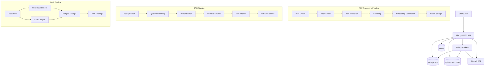
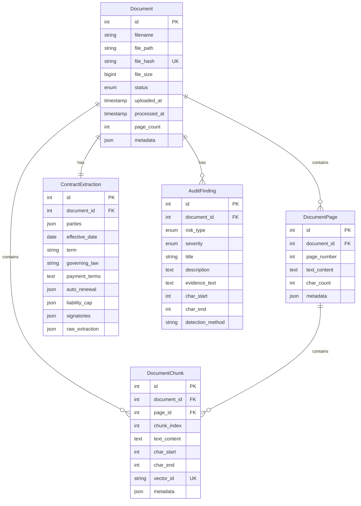

# Design Document: Contract Intelligence API

A production-ready system for contract analysis with PDF ingestion, extraction, RAG Q&A, and risk auditing.

---

## Architecture Overview



---

## Data Model

### Entity Relationship Diagram



**Key Design Decisions:**

1. **Document as Central Entity**: All data references a Document, enabling easy cleanup and tracking
2. **Separate Pages & Chunks**: Pages preserve document structure, chunks optimize retrieval
3. **vector_id in Chunks**: Links SQL records to Qdrant vectors for bidirectional queries
4 **JSONField for Flexibility**: Parties, signatories, auto_renewal as JSON for schema flexibility
5. **Indexes**: Hash, status, severity for common queries

---

## Chunking Rationale

### Strategy: Recursive Character Splitting

**Parameters:**
- Chunk size: 800 tokens (~3200 characters)
- Overlap: 100 tokens (~400 characters)

**Rationale:**

1. **800 tokens**: Balance between:
   - Too small: Loses context, increases retrieval noise
   - Too large: Dilutes relevance scores, wastes embedding space
   - 800 tokens ≈ 2-3 dense paragraphs of legal text

2. **100 token overlap**: Prevents clause fragmentation
   - Legal clauses often span multiple sentences
   - Overlap ensures critical phrases appear in ≥2 chunks
   - Helps with boundary cases (e.g., "Section 5.2 ... [chunk break] ... additional terms")

3. **Character-based splitting**: 
   - More predictable than word-based for diverse documents
   - Preserves punctuation context
   - Works well with pdfplumber output

**Alternatives Considered:**
- Semantic chunking (sentence embeddings): Too slow, inconsistent with legal formatting
- Fixed sentence count: Legal sentences vary wildly in length
- Section-based: Requires reliable section detection (not always present)

---

## Fallback Behavior

### 1. Extraction Fallback (LLM → Regex)

**Primary**: OpenAI function calling for structured extraction

**Fallback**: Regex patterns if LLM fails
- Dates: `\d{4}-\d{2}-\d{2}` patterns
- Governing law: `governed by the laws of ([A-Z][a-z]+)`
- Currency amounts: `\$[\d,]+` or `USD \d+`

**Rationale**: Regex is limited but reliable for basic pattern matching. Better than complete failure.

### 2. Audit Fail-Soft (Hybrid → Rules)

If LLM audit fails (API error, timeout):
- Fall back to rules-only mode
- Return partial results with warning
- Log error for debugging

**Rationale**: Rule-based detection still provides value even if LLM is unavailable.

### 3. RAG Retrieval Threshold

If no chunks score above threshold (0.7):
- Return "No relevant documents found"
- Prevents low-quality hallucinated answers

**Rationale**: Better to admit ignorance than provide incorrect information in legal context.

---

## Security Considerations

### 1. PII Redaction

**Implementation**: Middleware with regex patterns
- Emails: `[A-Za-z0-9._%+-]+@[A-Za-z0-9.-]+\.[A-Z|a-z]{2,}`
- SSN: `\d{3}-\d{2}-\d{4}`
- Phone: `\d{3}[-.]?\d{3}[-.]?\d{4}`
- Credit Card: `\d{4}[- ]?\d{4}[- ]?\d{4}[- ]?\d{4}`

**Limitations**: 
- Regex has false positives/negatives
- Consider NER model for production

### 2. File Validation

- Extension check: Must be `.pdf`
- Size limit: 50MB per file
- Hash-based deduplication: Prevents resource waste

### 3. CSRF & CORS

- Django CSRF protection enabled
- CORS configured for known domains only (in production)

### 4. Container Security

- Non-root user in Docker
- Read-only filesystem where possible
- Secrets via environment variables, not code

---

## Scalability Notes

### Current Limitations

1. **In-memory metrics**: MetricsMiddleware uses class variable
   - **Production fix**: Use Redis for shared metrics

2. **Synchronous LLM calls**: Blocking during extraction/audit
   - **Production fix**: Async OpenAI client with connection pooling

3. **Single Celery queue**: All tasks in one queue
   - **Production fix**: Separate queues for priority (ingest vs. extraction)

4. **No pagination on findings**: All audit findings returned at once
   - **Production fix**: Paginate via DRF

### Scaling Strategy

**Horizontal:**
- Add more Celery workers (CPU-bound PDF processing)
- Qdrant supports clustering for larger vector collections
- PostgreSQL read replicas for high query load

**Vertical:**
- Qdrant benefits from more RAM (in-memory index)
- Celery workers benefit from more CPU cores

**Cost Optimization:**
- Cache extraction results (already implemented)
- Batch embedding generation (100 texts/request vs. 1)
- Use `gpt-3.5-turbo` for simple extractions, GPT-4 for complex/audit

---

## Technology Choices

| Component | Choice | Alternative | Rationale |
|-----------|--------|-------------|-----------|
| Framework | Django REST | FastAPI | DRF has mature ecosystem, admin panel for debugging |
| Database | PostgreSQL | MySQL, MongoDB | Advanced JSON support, proven reliability |
| Vector DB | Qdrant | Pinecone, Weaviate | Open-source, easy Docker deployment, cosine similarity |
| Task Queue | Celery | RQ, Dramatiq | Industry standard, mature, integrates with Django |
| LLM | OpenAI GPT-4 | Claude, Local | Best accuracy, function calling support |
| PDF Library | pdfplumber | PyPDF2, pdfminer | Best text extraction quality, preserves formatting |

---

## API Design Philosophy

### RESTful Principles

- **POST /ingest**: Creates resources (documents)
- **POST /extract**: Triggers computation, idempotent with caching
- **POST /ask**: Query operation (POST for complex payloads)
- **GET /healthz**: Status check

### Async Processing

**Why?** PDF processing can take 10-60 seconds for complex documents.

**Pattern:**
```
1. POST /ingest → Returns document_ids immediately
2. Document status: pending → processing → completed
3. Poll GET /extract or use webhooks (TODO)
```

### Error Response Format

```json
{
  "error": true,
  "message": "Human-readable error",
  "details": { /* structured details */ }
}
```

---

## Monitoring & Observability

### Metrics Collected

1. Request count by endpoint
2. Response time (average)
3. Document processing success rate
4. Extraction success rate
5. Service health (Postgres, Qdrant, Redis)

### Logging Strategy

- Structured JSON logs
- PII automatically redacted
- Log levels: DEBUG (dev), INFO (prod)
- Celery task IDs for tracing

### Health Check Dependencies

`GET /healthz` checks:
- PostgreSQL (connection test)
- Qdrant (collections list)
- Redis (ping)

Returns 503 if any service unhealthy.

---

## Future Enhancements

If this were a real production system:

1. **Authentication**: API keys or OAuth2
2. **Rate Limiting**: Per-user/API key limits
3. **Webhooks**: POST to callback URL on completion
4. **Document Versioning**: Track contract amendments
5. **Comparison Mode**: Compare two contracts
6. **Custom Rules**: Allow users to define audit rules
7. **Multi-tenancy**: Separate documents by organization
8. **Audit Trail**: Track who accessed what document

---

## Testing Strategy

### Unit Tests

- Models: Validation, methods
- Services: PDF processing, extraction, RAG, audit
- Serializers: Validation logic

### Integration Tests

- API endpoints end-to-end
- Celery task execution
- Database transactions

### Evaluation

- Q&A dataset with expected answers
- Keyword-based scoring (simple but effective)
- Consider LLM-as-judge for production

**Current Score Target**: >80% accuracy on evaluation set

---

## Conclusion

This system demonstrates a production-ready architecture for contract intelligence with:
- Robust async processing
- Hybrid audit (rules + LLM)
- Grounded RAG with citations
- Comprehensive error handling
- Security & observability

Total implementation: ~2,500 lines of Python across services, views, models, and tasks.
